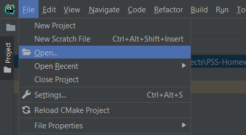

# PSS Homework

This program is implementation of an access system at the university. It has example of work at the main method.

## A version of the program 1.1

### how to run

CLion was used as the IDE for this project. If you have it, you will be able to open this project.
 However, no third-party libraries are used, other than the standard ones.

Version of c++20 were used.

To open it in Clion press File, than Open... and find this directory. Choose it and open.

## Generic Ideas of program

Program mainly consist of 4 file:

- main.cpp

main body of program, but here it has only example of system work

- enums.h

this file contains enums that are used in program

- rooms.h

this file has different classes of possible users

- users.h

this file has different classes of possible rooms

user.h and rooms.h both have class which other classes extends. 

In users.h classes have public getters for each field and setters, that work only when an admin perform an operation

in rooms.h all classes have getters and one of them has a setter, that works only when an admin perform the operation

## System of access

each class of persons has their own level of access that can be changed by an admin.

- guest - blue
- person - noLevel
- student- green
- employee - yellow
- professor -yellow
- director - red
- admin -red

each room has their own requirements for accessing it

- classroom - green+
- lecture room - green+/blue if it's on the first floor
- conference room - yellow+/blue if it's on the first floor
- cabinet - owner's id
- director cabinet - director user type

for all of them admins have access

---

admins can grant new level of access to any user, change their information such as name,surname,id e.t.c. also admins can set new owner to a cabinet

## Particular example in main

In main I create several users and rooms. Than show example of working system:

1. examples with cabinets
2. examples with director's cabinet
3. examples with lecture,conference and class rooms
4. Guest example
5. Admins features
6. special information
7. examples with special access to the room
8. emergency situation example

In guest example I show how admins can provide new level of access to specific person.

In admin features I show what will happen if non-admin will try to use setters, also shows another example of admins feature of changing information.

In special information I show which specific information you can get from a user and how it can be changed.

Everything is printed in the console.
